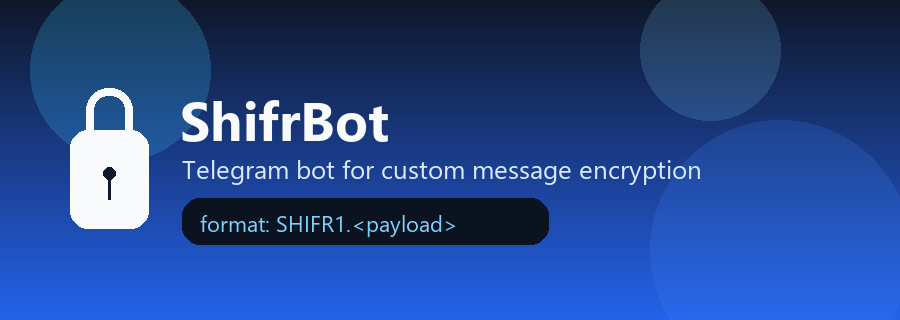
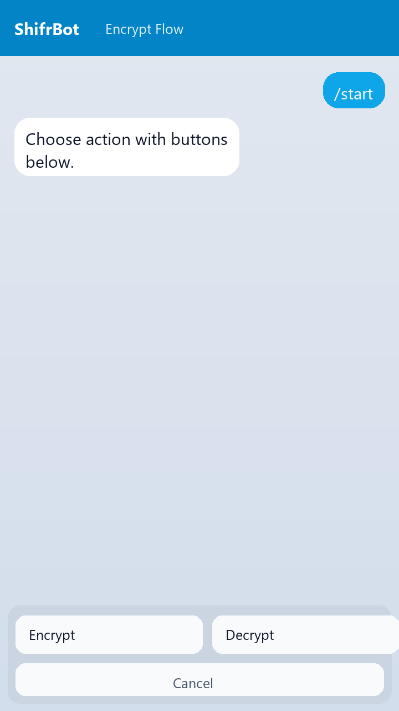
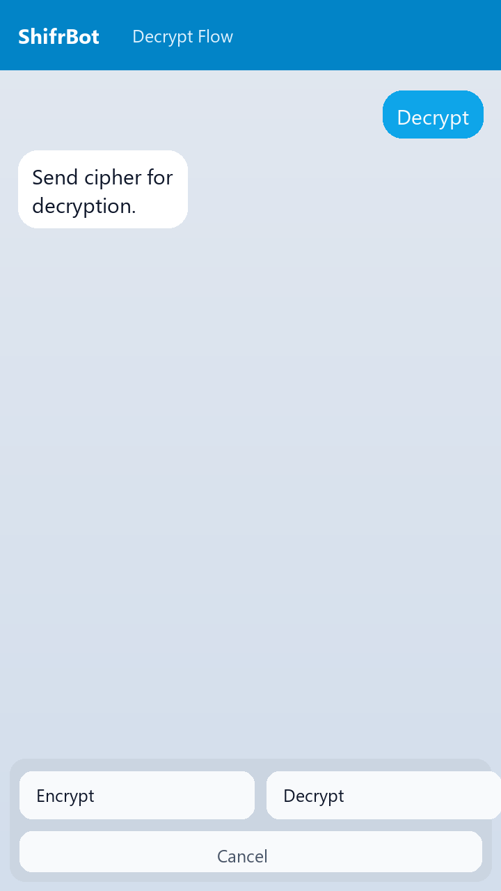
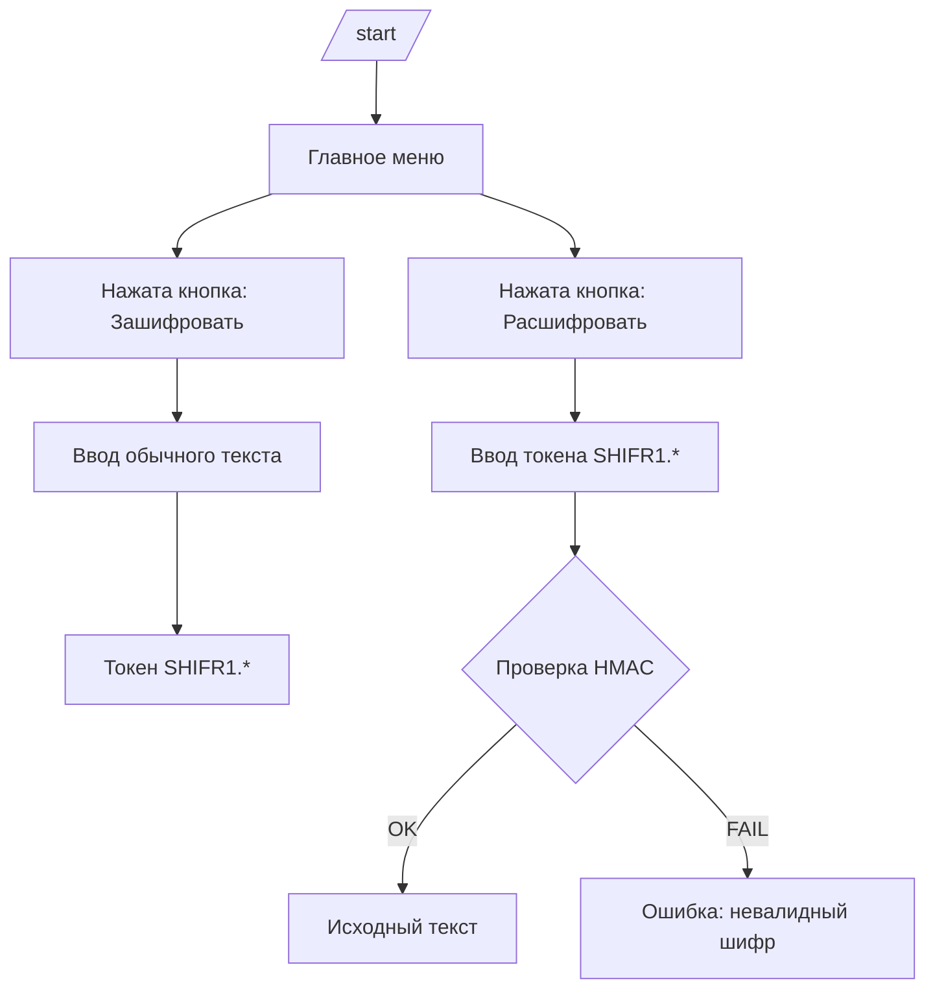

<div align="center">
  

  <h1>ShifrBot</h1>
  <p>
    Простой и удобный Telegram-бот на <b>aiogram 3</b> для шифрования и расшифровки сообщений<br/>
    в собственном формате <code>SHIFR1.&lt;payload&gt;</code>.
  </p>

  <p>
    
    
    
    
  </p>
</div>

## Содержание

- [Демо](#демо)
- [Что умеет бот](#что-умеет-бот)
- [Быстрый старт](#быстрый-старт)
- [Команды и кнопки](#команды-и-кнопки)
- [Как это работает](#как-это-работает)
- [Конфигурация](#конфигурация)
- [Структура проекта](#структура-проекта)
- [Проверка перед пушем](#проверка-перед-пушем)
- [Troubleshooting](#troubleshooting)
- [Безопасность](#безопасность)
- [Roadmap](#roadmap)

---

## Демо

<table>
  <tr>
    <td align="center"><b>Шифрование</b></td>
    <td align="center"><b>Расшифровка</b></td>
  </tr>
  <tr>
    <td></td>
    <td></td>
  </tr>
</table>

> [!TIP]
> Для максимального шифрования рекомендуется не разглашать SHIFR1 третьим лицам.

## Что умеет бот

- Шифрует текст в токен с префиксом `SHIFR1.`.
- Расшифровывает только корректные токены этого формата.
- Проверяет целостность токена (HMAC), чтобы отсечь случайные/битые строки.
- Работает через кнопки без сложных команд.
- Поддерживает отмену текущего сценария через кнопку и `/cancel`.

## Быстрый старт

### 1) Клонирование

```bash
git clone <URL_ТВОЕГО_РЕПОЗИТОРИЯ>
cd shifrbot
```

### 2) Установка зависимостей

<details>
<summary><b>Windows (PowerShell)</b></summary>

```powershell
python -m venv .venv
.\.venv\Scripts\Activate.ps1
pip install -r requirements.txt
$env:BOT_TOKEN="123456:ABCDEF_your_real_token"
python shif.py
```

</details>

<details>
<summary><b>Linux / macOS</b></summary>

```bash
python3 -m venv .venv
source .venv/bin/activate
pip install -r requirements.txt
export BOT_TOKEN="123456:ABCDEF_your_real_token"
python shif.py
```

</details>

> [!IMPORTANT]
> Токен бота берется у `@BotFather`. Без `BOT_TOKEN` бот не запустится.

## Команды и кнопки

### Команды

| Команда | Что делает |
| --- | --- |
| `/start` | Сбрасывает состояние и показывает главное меню |
| `/cancel` | Отменяет текущий шаг и возвращает кнопки |

### Кнопки

| Кнопка | Сценарий |
| --- | --- |
| `🔐 Зашифровать` | Бот просит ввести текст и возвращает токен |
| `🔓 Расшифровать` | Бот просит токен и возвращает исходный текст |
| `❌ Отмена` | Прерывает текущий ввод |

## Как это работает



### Внутри токена

1. Генерируется `nonce`.
2. Создается ключ-поток на базе `SHA-256`.
3. Сообщение шифруется побайтно (XOR-маска).
4. Добавляется `HMAC` для проверки целостности.
5. Результат кодируется в URL-safe Base64 и получает префикс `SHIFR1.`.

## Конфигурация

| Параметр | Где | Назначение |
| --- | --- | --- |
| `BOT_TOKEN` | Переменная окружения | Токен Telegram-бота (обязателен) |
| `SECRET_KEY` | `shif.py` | Внутренний ключ шифрования |
| `CIPHER_PREFIX` | `shif.py` | Префикс формата токена |
| `NONCE_SIZE` | `shif.py` | Размер nonce |
| `MAC_SIZE` | `shif.py` | Длина подписи HMAC |

> [!WARNING]
> После изменения `SECRET_KEY` старые токены расшифровать не получится.

## Структура проекта

```text
shifrbot/
├─ assets/
│  ├─ banner.png
│  ├─ demo-encrypt.gif
│  └─ demo-decrypt.gif
├─ shif.py
├─ requirements.txt
└─ README.md
```

## Проверка перед пушем

```bash
python -m py_compile shif.py
```

## Troubleshooting

- `RuntimeError: ... BOT_TOKEN`
  - Не установлена переменная окружения `BOT_TOKEN`.
- `Неизвестный формат шифра`
  - Передан текст не формата `SHIFR1...`.
- `Проверка не пройдена`
  - Токен поврежден или создан с другим `SECRET_KEY`.

## Безопасность

- Текущая реализация подходит для учебных и бытовых задач.
- Для production-секретов лучше перейти на стандартные криптопримитивы и отдельный secret management.
- Никогда не публикуй `BOT_TOKEN` и рабочий `SECRET_KEY`.

## Roadmap

- [ ] Вынести `SECRET_KEY` в `.env`
- [ ] Добавить unit-тесты на `encrypt/decrypt`
- [ ] Dockerfile + docker-compose
- [ ] Inline-кнопки и историю операций

---

<div align="center">
  Сделано с акцентом на удобство, чистый UX и быстрый запуск.
</div>
